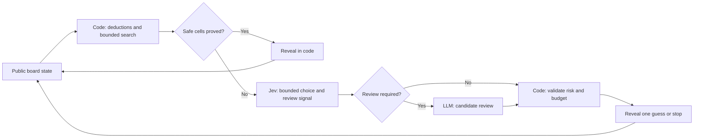

# Minesweeper Thinking Lab

**Three experiments in fast decisions, deliberate reasoning, and the code that connects them.**

Can a focused System One model make useful decisions cheaply? When is an LLM
worth the extra time? We use Minesweeper to test those questions with
[TypeSafe Jev](https://docs.typesafe.ai/concepts/system-one.md), an OpenRouter
LLM, deterministic solvers, and boards ranging from 9×9 to 500×500.

This standalone research repository brings together the browser experiments,
the System One + System Two benchmark, the research article, and the recorded
results. It grew out of [jev-playground](https://github.com/imom39a/jev-playground).
The first release is **v0.1.0 — research preview**.

[Read the article](minesweeper/docs/system-one-system-two-article.md) ·
[Architecture](docs/architecture.md) ·
[Full research](minesweeper/docs/system-one-system-two-research.md) ·
[Recorded results](minesweeper/results/) ·
[Run guide](minesweeper/README.md)

## The three experiments

| Variant | Question | Run it |
| --- | --- | --- |
| **1 · LLM vs Jev** | How do a text-generating LLM and a typed decision model behave under the same original game policy? | Browser at [`/`](http://127.0.0.1:5391/) |
| **2 · System One alone** | Can Jev work with a bounded candidate frontier on very large boards without receiving the entire grid? | Browser at [`/v2/`](http://127.0.0.1:5391/v2/) |
| **3 · System One + System Two** | Does selective LLM review improve on Jev and stronger deterministic inference? | `python3 -m minesweeper.benchmark` |

“System One alone” means Jev is the only model; ordinary code still implements
the game, deductions, candidates, and execution. Variant 3 is a CLI experiment
with `heuristic`, `code`, `proof`, `jev`, `llm`, and `hybrid` arms. It is not yet
integrated into either browser interface. The browser variants preserve the
original policy, so their behavior should not be confused with the stronger
benchmark solver.

## What we found

| Experiment | Recorded result | What it supports |
| --- | --- | --- |
| 100 held-out expert boards, 30×16 / 99 mines | Stronger code **52 wins**, old heuristic **32 wins** | Better deterministic inference improved completion. [Records](minesweeper/results/expert-heldout.json) |
| Four identical uncertain expert states | Jev: **3 safe / 1 mine**; hybrid: **2 safe / 1 mine / 1 failed decision** | No demonstrated hybrid reliability gain in this pilot. [Records](minesweeper/results/expert-live-replay-v2.json) |
| Same four-state live pilot | Median cumulative provider time: **0.42 s Jev**, **20.70 s hybrid** | Focused Jev decisions were faster here; all four hybrid states escalated. [Records](minesweeper/results/expert-live-replay-v2.json) |
| 20 larger boards, 50×50 / 500 mines | Stronger code **7 wins** | Large-board completion remains difficult. [Records](minesweeper/results/large-search-48.json) |

The live pilot used `jev-1.13.0` and `openai/gpt-oss-20b`. Four next-action
comparisons are not a full-game win-rate study or a general service benchmark.
Two states had only one admissible minimum-risk move, limiting what either
model could change. The cascade saved no LLM calls on these four states;
missing provider costs remain unknown. See the
[research report](minesweeper/docs/system-one-system-two-research.md#local-experiment-results)
for failures, uncertainty, earlier pilots, and full-board results.

The useful efficiency principle is to **do exact work in code, ask models
bounded questions, and measure whether escalation earns its cost**. Our results
support improving the solver first and keeping the cascade experimental.

## Run locally

Requires **Python 3.10+**. No Node.js, frontend build, or third-party Python
package is needed to run from a checkout.

```bash
git clone https://github.com/imom39a/minesweeper-thinking-lab.git
cd minesweeper-thinking-lab

# Offline smoke experiment: no API keys or model calls.
python3 -m minesweeper.benchmark --width 9 --height 9 --mines 10 \
  --modes heuristic,code,proof --seeds 3 --seconds 10 \
  --output /tmp/minesweeper-smoke.json

# Browser experiments: edit .env with the provider keys you want to use.
cp .env.example .env
python3 -m minesweeper.server
```

Open [LLM vs Jev](http://127.0.0.1:5391/) or
[Jev large boards](http://127.0.0.1:5391/v2/). Use `JEV_API_KEY` or
`TYPESAFE_API_KEY` for Jev, and `OPENROUTER_API_KEY` for the LLM. The server
loads the root `.env`; credentials stay on the server. Provider-backed runs
consume provider credits. The committed reports can be read without credentials.

### Reproduce the deterministic comparison

```bash
python3 -m minesweeper.benchmark --modes heuristic,code,proof \
  --width 30 --height 16 --mines 99 --max-component-cells 48 \
  --seed-start 100 --seeds 100 --seconds 10 \
  --output /tmp/minesweeper-expert-heldout.json
```

The published reports are historical measurements, not freshly rerun scores.
Runtime budgets can affect outcomes on a different machine. New commands write
to `/tmp` so the original evidence remains intact.

### Compare System One, System Two, and their cascade

Run this block in **bash**, after adding credentials to `.env`:

```bash
source scripts/load-jev-env.sh
python3 -m minesweeper.benchmark --live --modes code,jev,llm,hybrid \
  --jev-model jev-1.13.0 --llm-model openai/gpt-oss-20b \
  --max-component-cells 48 --seeds 10 --replay-states 4 \
  --seconds 50 --max-calls 2 \
  --output /tmp/minesweeper-live-replay.json
```

This regenerates frozen observations from seeded code trajectories, then asks
each arm to choose under the same evidence. It makes live provider requests;
outputs and timing can vary. Omit `--replay-states 4` for full episodes. See the
[run guide](minesweeper/README.md) for System One only, budgets, and all modes.

## Architecture



This is the variant 3 hybrid path. The other benchmark arms share the same
solver and swap the decision policy. Jev's Choice confidence and the solver's
mine probability are separate values. The review threshold is experimental;
model output never establishes a safety proof.

[Architecture details](docs/architecture.md) explain the control paths, typed
questions, limits, and what changes between variants.

## Explore and contribute

- [Article: Testing System One + System Two in Minesweeper](minesweeper/docs/system-one-system-two-article.md)
- [Research with primary sources and all measured results](minesweeper/docs/system-one-system-two-research.md)
- [Future web integration plan](minesweeper/docs/v0.2-release-plan.md)
- [Release notes](CHANGELOG.md) and [attribution](ATTRIBUTION.md)

```bash
python3 -m unittest discover -s minesweeper -p 'test_*.py'
python3 -m compileall -q minesweeper
```

The tests mock provider calls. Next experiments should compare deterministic
lookahead with learned choices on genuine ties, skip calls when code already
determines the action, and evaluate routing on fresh held-out states. The
planned Solver Lab browser integration remains future work. Drone flight is a
later research direction with its own evaluation; no flight code is included.
