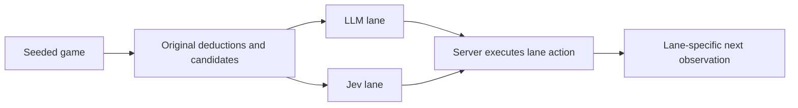
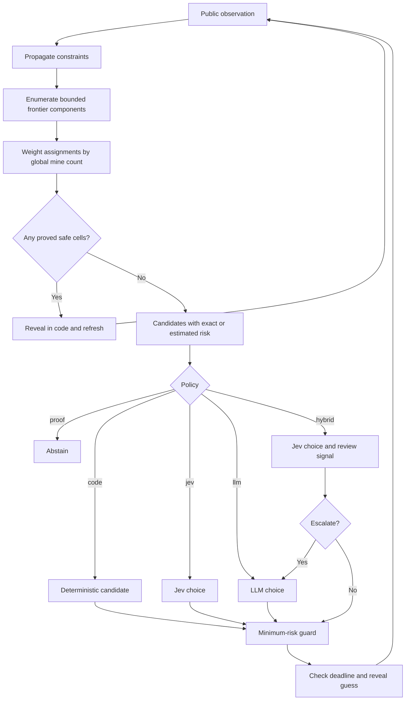

# System One, System Two, and deterministic control

Minesweeper Thinking Lab tests three architectures. “System One” means
TypeSafe Jev's focused, typed decision model. “System Two” means the role given
to an OpenRouter LLM in this experiment. These names describe software roles;
they do not establish equivalence with human cognition.
[TypeSafe's definition](https://docs.typesafe.ai/concepts/system-one.md)

## 1. LLM versus System One

The original browser at `/` sends two players the same seeded starting board.
[game.py](../minesweeper/game.py) constructs a bounded candidate list using
single-clue/subset deductions and a local heuristic risk estimate.
[agents.py](../minesweeper/agents.py) asks each model to pick a safe candidate,
or the lowest estimated risk if no proof is available. The server executes the
selection and exposes a decision stream to the browser.

The two lanes can diverge after different actions. A full-game comparison is
therefore not a sequence of identical-state comparisons. The browser retains
the original controller behavior; benchmark guards and failure semantics below
do not automatically apply to it.

## 2. System One alone on large boards

The `/v2/` browser uses Jev as its only model and retains the original game
policy. Code narrows a board of up to 500×500 cells to an offered frontier.
Above 4,096 cells, model state omits the full grid. This tests a useful design
idea: model input can follow the decision boundary rather than board area.
[Candidate construction and state](../minesweeper/game.py)

Code still has to update the board and compute constraints. A compact request
is not evidence of bounded end-to-end latency, and accepting 500×500 input is
not evidence of solving it. The retained maximum-size benchmark timed out;
the [scale results](../minesweeper/docs/system-one-system-two-research.md#offline-full-board-results)
report coverage and terminal outcomes separately.

## 3. Stronger inference with optional System Two review

The CLI separates inference quality from model choice. It runs the same
stronger solver for the `code`, `proof`, `jev`, `llm`, and `hybrid` arms;
`heuristic` provides the older code-only baseline.

Source: [solver.py](../minesweeper/solver.py),
[hybrid.py](../minesweeper/hybrid.py), and
[benchmark.py](../minesweeper/benchmark.py).

### Responsibilities

| Component | Responsibility |
| --- | --- |
| Game/evaluator | Seeded hidden layout, observations, reveal outcomes, win/loss truth |
| Constraint solver | Deductions, bounded model counting, risk provenance, candidates |
| Jev | Choose a supplied candidate and judge whether the observation warrants review |
| LLM | Independently review the same bounded evidence and propose a candidate |
| Controller | Provider budgets, risk guard, deadlines, execution, explicit failures |
| Reporter | Keep public state separate from truth labels; preserve outcomes and usage |

The solver reads public observations. Only the game transition and evaluator
use hidden mine locations. Replay records store truth labels outside the state
submitted to either provider.

### Typed questions and routing

Jev receives two independent questions in one request: a Choice over offered
cells and a Noul asking whether visible structural differences warrant slower
comparison. The review question cannot inspect the Choice answer. Code combines
them afterward. This follows TypeSafe's
[fan-out design](https://docs.typesafe.ai/patterns/fan-out.md).

The current hybrid escalates for incomplete probabilities, a missing review
signal, a proposed action that fails the candidate/risk check, or review
probability at least **0.65**. Questions and policy constants live together in
[hybrid.py](../minesweeper/hybrid.py). The threshold is a pilot parameter and has
not been calibrated. `jev` mode records the same review signal without using
an LLM.

Choice confidence describes concentration among offered alternatives, not
`P(cell is safe)`. Solver mine probability has a different meaning and source.
A tie between equally good actions may appropriately yield diffuse preference.
[TypeSafe confidence documentation](https://docs.typesafe.ai/confidence.md)

### Exactness and bounded execution

Completed enumeration counts consistent assignments and weights them by the
global mine budget and unconstrained cells. If the configured search or
weighting budget cannot finish, the solver marks estimates incomplete. It does
not turn an unfinished count of zero into a safety proof.

Every model choice is checked against the minimum computed risk. Out-of-set or
higher-risk proposals are corrected to the deterministic fallback and logged.
This enforces a policy over the supplied estimate; an approximate estimate
cannot guarantee the lowest true risk. The experiment does not permit models
to invent deductions or choose higher immediate risk for future information.

Provider failures and exhausted budgets stop an episode or replay decision
explicitly. Decisions returned after the deadline are discarded. Local solver
and flood-fill operations are not preempted midway, so the time budget is not a
hard real-time bound. The CLI's synchronous observations also differ from the
future asynchronous web controller's revision checks.

## What the evidence changes

The stronger solver improved held-out expert completion from 32/100 to 52/100.
That improvement used no model. On four shared uncertain states, Jev's median
cumulative provider time was 0.42 seconds versus 20.70 seconds for the hybrid;
all four hybrid states escalated and no reliability gain was demonstrated.
[Full results and limitations](../minesweeper/docs/system-one-system-two-research.md#local-experiment-results)

The next controller should skip model calls when only one allowed guess exists,
then compare deterministic lookahead, Jev, LLM, and learned routing on genuine
ties. A matched-call random escalation control can help test whether a learned
review signal selects useful cases. These are future experiments, as is the
[Solver Lab browser integration](../minesweeper/docs/v0.2-release-plan.md).

For later drone research, the transferable design is bounded proposals with
independent execution checks and explicit handling of unavailable or stale
results. Mine-risk thresholds and game completion rates are not flight evidence.
