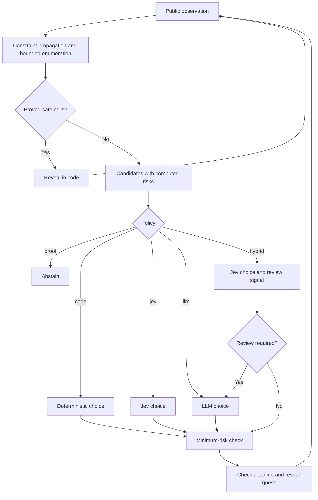

# Architecture

The repository contains the two original browser experiments, the V3 context
lab, and a separate benchmark CLI.
They share the game engine and provider clients, but use different solvers and
controllers. “System One” denotes TypeSafe Jev; “System Two” denotes the LLM's
analysis role: proposing moves before Jev in V3, or reviewing Jev decisions
in the CLI hybrid policy. These are software roles rather than claims
about human cognition. See [TypeSafe's System One definition](https://docs.typesafe.ai/concepts/system-one.md).

## Browser experiments

The comparison at `/` starts an LLM lane and a Jev lane on the same seeded board.
[game.py](../minesweeper/game.py) applies single-clue and subset deductions, then
constructs a bounded candidate list with heuristic risks.
[agents.py](../minesweeper/agents.py) asks each model to choose a proved-safe cell
or, when a guess is necessary, a cell with the lowest supplied risk. The server
executes the choice and streams the result to the browser. Different actions
can cause the lanes' observations to diverge.

The Jev-only browser at `/v2/` uses the same policy on boards up to 500×500.
Above 4,096 cells, provider input omits the full grid and includes a board
summary, frontier candidates, and local constraints. This bounds model input;
local board processing still grows with the problem size.

Both browsers retain the original provider-per-turn controller, including its
random fallback on provider failure. The benchmark's failure handling and risk
checks described below apply to the CLI.

## Benchmark control flow

The `code`, `proof`, `jev`, `llm`, and `hybrid` modes use the stronger solver in
[solver.py](../minesweeper/solver.py). The `heuristic` mode is the original
deterministic baseline. Mode definitions and commands are in the
[run guide](../minesweeper/README.md).

The game and evaluator own hidden mine locations. The solver consumes public
observations, and providers receive candidate risks and bounded constraints.
Replay truth labels are stored separately from provider input.

### Solver guarantees

The solver enumerates consistent assignments within frontier components and
weights them by the global mine count and the number of possible assignments
to unconstrained cells. Completed calculations provide exact probabilities
under the board prior. A component-size limit and shared search/weighting budgets
bound the work.

Incomplete calculations are marked as estimates. An unfinished count of zero
does not establish safety. Flags are annotations, not evidence that a cell
contains a mine. Code reveals proved-safe cells without calling a model.

### Model interface and routing

[hybrid.py](../minesweeper/hybrid.py) keeps prompts and policy thresholds
together. Jev receives two questions in one request:

- A **Choice** selects a cell from the supplied candidates.
- A **Noul** estimates whether visible structural differences warrant slower review.

The questions are independent: the review question cannot inspect the Choice
answer. The `jev` mode records both answers but never calls the LLM. The `hybrid`
mode requests LLM review when any of these conditions holds:

- Solver probabilities are incomplete.
- Jev's proposed cell is absent from the candidate list or exceeds the minimum computed risk.
- The review signal is missing or is at least **0.65**.

The threshold is an uncalibrated experiment parameter. Choice confidence is
recorded separately and does not trigger review. It measures concentration among
offered alternatives, not the probability that a cell is safe; several equally
good choices can produce low confidence. See the
[TypeSafe confidence documentation](https://docs.typesafe.ai/confidence.md).

The LLM receives the same bounded evidence as the LLM-only policy, without Jev's
proposed answer. It returns a candidate and a short rationale. Neither model
can establish a safety proof.

### Execution checks and failures

Code checks each model proposal against the minimum computed candidate risk.
An out-of-set or higher-risk proposal is replaced with the deterministic
fallback and the correction is logged. With approximate risks, this enforces
the supplied estimate rather than guaranteeing the lowest true risk. Models
may choose among ties but cannot trade higher immediate risk for future
information.

[benchmark.py](../minesweeper/benchmark.py) enforces provider-call and elapsed-time
budgets. Provider errors stop the episode or replay decision. Results received
after the deadline are discarded. Solver and flood-fill operations are not
preempted midway, so the elapsed-time budget is not a hard real-time bound.

The current benchmark calls models even when only one minimum-risk candidate
exists. Skipping those calls, calibrating review, and integrating this controller
into a browser are tracked in the [roadmap](roadmap.md). Evaluation results and
their limitations are in the
[research report](../minesweeper/docs/system-one-system-two-research.md).

## V3: System 1 and System 2

The [V3 guide](v3-context-lab.md) describes the separate session at `/v3/`.
Neither visible UI mode supplies solver deductions or risk estimates.

| Mode | Input and decision flow |
| --- | --- |
| System 1 | Code samples frontier candidates and gathers visible clues → Jev selects → code executes |
| System 1 + System 2 | Full visible board → LLM proposes cells and rationales → Jev selects a proposal → code executes |

[context_lab.py](../minesweeper/context_lab.py) constructs public inputs and
validates LLM proposals for format, count, uniqueness, bounds, and legality.
It does not rank, repair, or replace the proposals. The combined mode's Jev
Choice options exactly match the LLM's proposals; the visible board is included
alongside that unverified advice. The baseline's code-sampled options and
prompt differ, so this is an architecture comparison, not an identical-input
model comparison. An equation baseline remains API-only for reproducibility.

System 2 has a 120-second request limit and Jev a 20-second limit, both bounded
by the remaining game time. Execution checks the current run, stop state, and
deadline before applying the result. Provider or proposal failures stop V3
without the original browsers' random fallback or the CLI's risk correction.
The UI identifies the active model and displays failure reasons above the board.

This LLM → Jev flow is separate from the CLI's guarded Jev → LLM cascade.
The historical CLI results do not measure V3's reliability.
