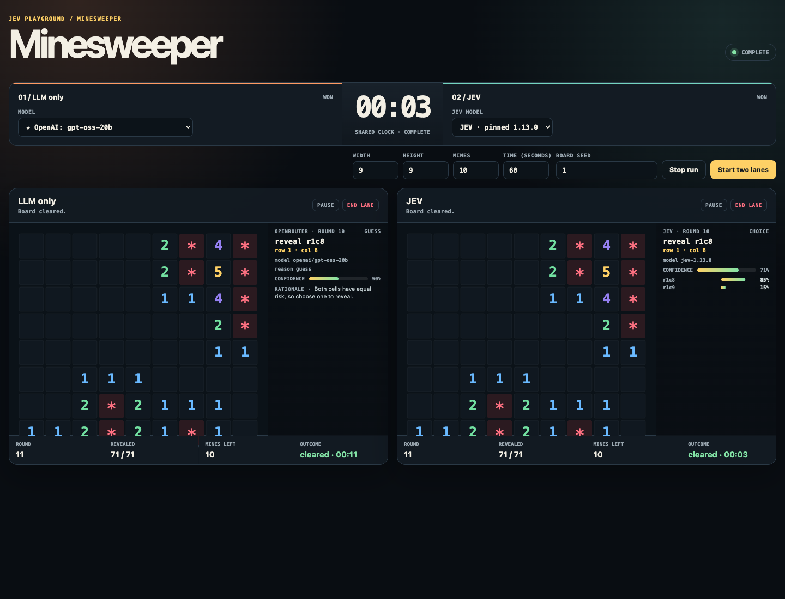
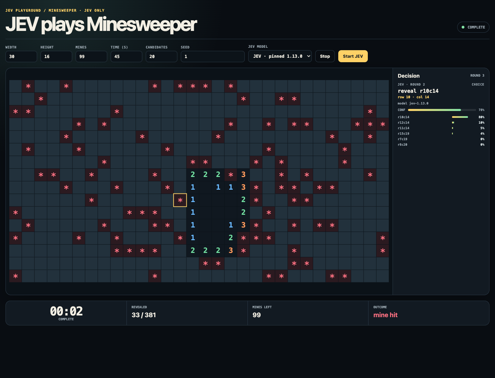
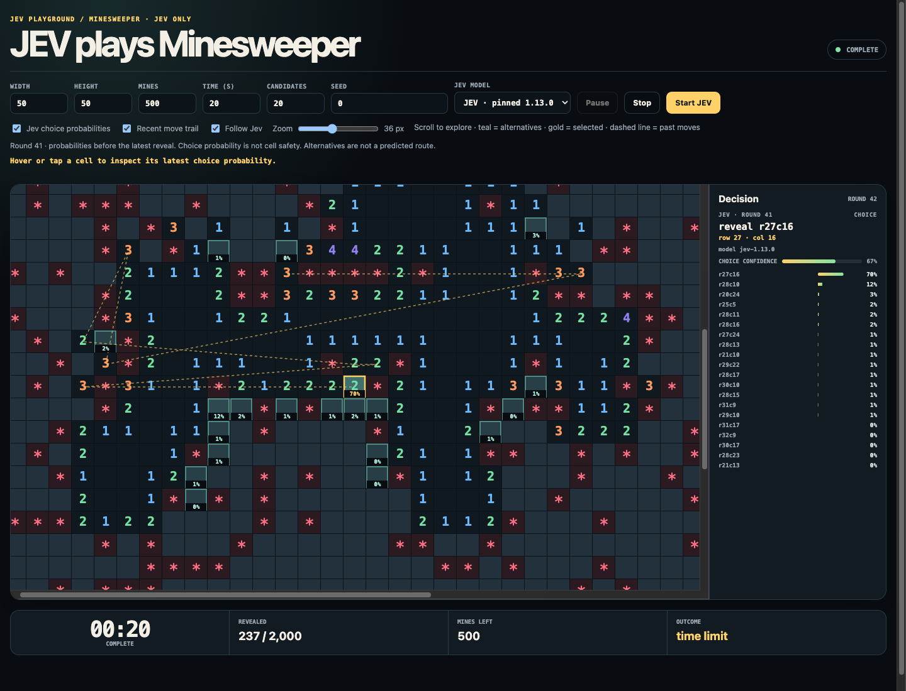

# Gameplay and repeat experiments

## Browser comparison

The comparison route (`/`) runs two models on the same seeded board. This
9×9 board has 10 mines and seed 1; the models are `openai/gpt-oss-20b` and
`jev-1.13.0`. Both lanes cleared the board.



## Jev-only browser

The Jev route (`/v2/`) uses compact candidate input and supports larger boards.
This expert board is 30×16 with 99 mines and seed 1, using `jev-1.13.0` with
20 candidates and a 45-second budget. The game ended on a mine after revealing
33 of 381 safe cells.



Both screenshots were captured from real provider-backed games on September 22,
2026. They illustrate the original browser policy; the stronger solver and
hybrid experiment run through the CLI. The displayed confidence is model
preference, not cell safety. Individual games and their displayed clocks do not
establish relative reliability or service latency.

## Cell probabilities and large-board navigation

V2 keeps cells readable on large boards with adjustable zoom and scrolling in
both directions. The example below shows part of a 50×50 board with 500 mines
(seed 0, `jev-1.13.0`, 20-second budget).



Teal outlines identify alternatives from the latest decision; gold identifies
the selected cell. Percentages are Jev's choice probabilities before that
reveal, not probabilities of avoiding a mine. Hover or tap to inspect changes
in percentage points when the same candidate appeared in the previous round.
Selecting a sidebar candidate moves the viewport to that cell.

The viewport stays fixed by default. **Show latest move** jumps once without
enabling automatic scrolling. Opt into **Follow Jev** to track moves, or use
**Pause** to inspect between moves. The dashed trail shows past moves;
it does not forecast a route. Only visible cells are drawn, so increasing the
board size does not require a board-sized canvas.

## Offline repeat experiments

The following September 22, 2026 runs use the code at
[29bcfd5](https://github.com/imom39a/minesweeper-thinking-lab/commit/29bcfd579e5269be1edbe4e0fe052166ba3b99ab),
component cap 48, 200,000 search nodes, and a ten-second budget per episode.
These repeat existing seed ranges and are regression checks, not new held-out
evidence. The original study's datasets remain separate.

| Board | Seeds | Heuristic wins | Code wins | Proof wins / abstentions | Records |
| --- | --- | ---: | ---: | ---: | --- |
| 9×9 / 10 mines | 0–29 | 29/30 | 30/30 | 28 / 2 | [Beginner](../minesweeper/results/verification/beginner.json) |
| 30×16 / 99 mines | 100–199 | 32/100 | 52/100 | 15 / 85 | [Expert](../minesweeper/results/verification/expert.json) |
| 50×50 / 500 mines | 0–19 | 3/20 | 7/20 | 3 / 17 | [Large](../minesweeper/results/verification/large.json) |

These completion counts match the corresponding original comparisons. The
beginner study originally used cap 22; the repeat uses cap 48. Timing depends
on the host and concurrent work.

To repeat a configuration, run from the repository root and write to a new
output file:

```bash
python3 -m minesweeper.benchmark --modes heuristic,code,proof \
  --width 30 --height 16 --mines 99 --seed-start 100 --seeds 100 \
  --max-component-cells 48 --max-search-nodes 200000 --seconds 10 \
  --output /tmp/minesweeper-expert-repeat.json
```

## Live replay repeat

Four first-uncertain expert observations were evaluated using `jev-1.13.0`
and `openai/gpt-oss-20b`, component cap 48, a fifty-second budget per policy
per state, and at most two provider calls per decision.

| Policy | Safe reveals | Mine reveals | No decision | Provider calls | Median cumulative provider time |
| --- | ---: | ---: | ---: | ---: | ---: |
| Code | 3 | 1 | 0 | 0 | — |
| Jev | 3 | 1 | 0 | 4 | 0.51 s |
| LLM | 1 | 1 | 2 | 4 | 20.74 s |
| Hybrid | 2 | 1 | 1 | 8 | 16.92 s |

The LLM-only policy returned one invalid decision and timed out once. The
hybrid escalated all four states and returned one invalid decision. Its three
completed reviews neither rescued nor harmed the guarded initial Jev choice.
These are one-step outcomes from a small repeated sample, not full-game win
rates or a controlled latency comparison. Live outcomes differ from the
original pilot; both records are retained.

[Replay configuration, decisions, and outcomes](../minesweeper/results/verification/live-replay.json)
are stored separately from the original study. To run the same protocol after
loading credentials in Bash:

```bash
source scripts/load-jev-env.sh
python3 -m minesweeper.benchmark --live --modes code,jev,llm,hybrid \
  --width 30 --height 16 --mines 99 --jev-model jev-1.13.0 \
  --llm-model openai/gpt-oss-20b --max-component-cells 48 \
  --seeds 10 --replay-states 4 --seconds 50 --max-calls 2 \
  --output /tmp/minesweeper-live-repeat.json
```

The [run guide](../minesweeper/README.md) covers credentials and live commands;
the [research report](../minesweeper/docs/system-one-system-two-research.md)
contains the original study's methods and limitations.
