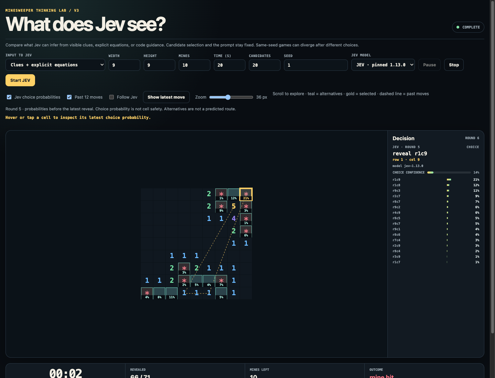

# V3: what does Jev infer from the input?

Open `/v3/` to compare three representations of the same public evidence.
V3 has its own game session, separate from the original browser experiments.
It retains zoom, manual scrolling, choice percentages, and optional following.

| Input mode | Evidence supplied | Solver assistance |
| --- | --- | --- |
| Visible clues only | Candidate coordinates, revealed clue coordinates and numbers, nearby unknown-cell coordinates, board counts | None |
| Clues + explicit equations | The same evidence plus the exact unknown neighbors counted by each clue | No deductions or risk estimates |
| Clues + equations + code guidance | The same evidence and equations plus the existing browser solver's proven-safe/proven-mine labels and risk estimates | Explicitly supplied |

Equations restate observations. For example, a revealed `1` bordering unknown
cells A, B, and C becomes `A + B + C = 1`. The equation mode does not simplify
or combine equations, mark cells safe, or calculate mine probabilities.

## What stays fixed

All modes use the same prompt and candidate-selection procedure. Code evenly
samples the frontier in row/column order up to the candidate limit; it does
not rank by safety or remove proven mines. If there is no frontier, it samples
unrevealed, unflagged cells. Candidates are identical **for identical board
states**. Code still owns game rules, legal-action checks, and execution.

The context starts with clues adjacent to the candidates and expands through
shared unknown neighbors, up to 512 clues. Both unguided modes receive the
same clue set; equation mode adds explicit memberships. A truncation flag and
scope description identify incomplete context. Unconnected regions may be
omitted even when expansion completes. No mode receives hidden mine locations
or move history.

The assisted mode uses the original browser deductions and heuristic risks,
not the stronger CLI solver. Unlike V2, it retains V3's neutral candidate set
and prompt. This isolates supplied guidance from candidate filtering.

## Inspect and compare

1. Choose a board size, seed, pinned Jev model, candidate limit, and input mode.
2. Start the game. Expand **Input sent to Jev** below the board to inspect the
   exact latest request, including the Choice prompt and offered answers.
3. Use **Download request JSON** to retain that request without credentials.
4. Repeat with the same settings and another mode.

Different choices lead to different subsequent board states, so same-seed
full games are not identical-state decision comparisons. A controlled study
should replay frozen observations across all modes and report repeated games,
failures, calls, and latency. The UI itself does not establish which mode is
more capable.

V3 stops on provider errors, invalid choices, and expired decisions. It makes
no random replacement move and applies no minimum-risk correction. Choice
percentages remain model preferences, not probabilities of cell safety.

Implementation: [context construction](../minesweeper/context_lab.py),
[provider adapter](../minesweeper/agents.py), and
[isolation tests](../minesweeper/test_context_lab.py).
