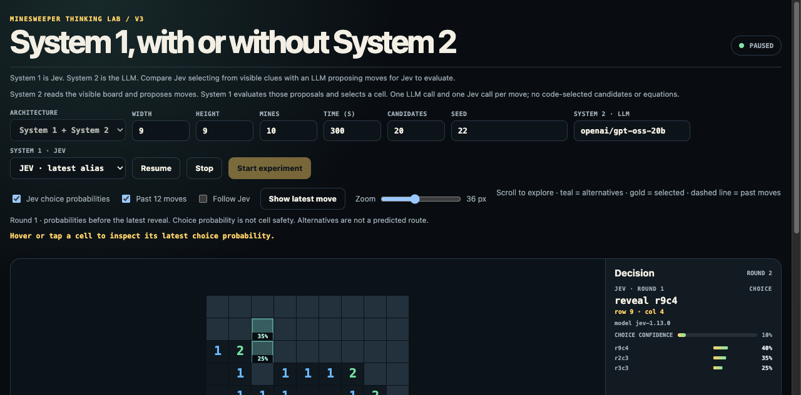

# V3: System 1 and System 2

Open `/v3/` to compare System 1 (Jev) alone with System 1 + System 2 (an LLM).
V3 has its own session and retains zoom, manual scrolling, choice percentages,
and optional following.

| Mode | Input preparation | Who proposes moves? |
| --- | --- | --- |
| System 1 · Jev | Coordinates and numbers of nearby revealed clues | Code samples the visible frontier |
| System 1 + System 2 | Full visible board goes to an LLM; Jev receives that board and the LLM's proposals and rationales | LLM |

## System 1 + System 2

1. Code serializes the full visible board as rows: `?` for hidden cells, `F`
   for flags, and digits for revealed clues. Coordinates are 1-based (`r1c1`).
2. The LLM receives the board, game rules, and a maximum proposal count. It
   selects hidden cells and supplies concise rationales. Code supplies no
   frontier shortlist, equations, deductions, or risk estimates.
3. Code validates the response: proposals must be distinct, within the count
   limit, on the board, hidden, unflagged, and accompanied by rationales.
   Invalid output stops the run; code does not repair or replace proposals.
4. Jev receives the visible board and unverified LLM proposals. Its Choice
   options are exactly those proposals, in the LLM's order. Code executes the
   chosen legal move.

Select the OpenRouter model in **System 2 · LLM**. This mode requires an
`OPENROUTER_API_KEY` and a Jev key. It makes one LLM call followed by one Jev
call per decision; both count toward the game deadline. System 2 has up to
120 seconds per request, bounded by the remaining game time. The status badge
identifies the active model, a failed request, or a reached time limit.
Jev requests have a 20-second limit. Large boards send more input and may
exceed a provider's context or time limits. The board is not silently cropped. Hidden mine locations and move history are never sent.

This tests Jev's selection among LLM proposals, not independent Minesweeper
solving by Jev. LLM rationales may be wrong. No solver verifies them or corrects
the selected move. The shared initial reveal remains the fixed safe opening
used by the browser experiments.

## System 1 baseline

The System 1 UI mode uses visible clues and code-sampled candidates. The earlier
equation variant remains available through the API for reproducibility, but
is no longer a UI option. Those two baselines share candidates and prompts.
Code samples the frontier in row/column order, without safety ranking or
filtering proven mines. With no frontier it samples hidden, unflagged cells.
Context expands through connected clues around the candidates, capped at 512
clues; its scope and truncation status are included in the input.

Equations only restate observations: a revealed `1` bordering A, B, and C
becomes `A + B + C = 1`. Code does not combine or solve these equations.
These baselines provide domain-specific structure even though they do not
supply a computed solution. Their candidates and prompts differ from
System 1 + System 2.

## Inspect and compare

Choose a board, seed, **Architecture**, pinned Jev model, and **Candidates**
limit. That limit caps code-sampled options in System 1 and LLM proposals in
combined mode. Expand **Input sent to Jev** to inspect or download the exact
latest request, including the LLM proposals when present. While System 2 is working,
the inspector still shows the preceding Jev request, or no request before the
first proposals arrive. Credentials are excluded.

Same-seed games can follow different trajectories. Compare repeated games,
failures, cost, and end-to-end latency before drawing performance conclusions.
V3 stops on provider errors, invalid choices, or expired decisions. Choice
percentages describe Jev's preferences, not probabilities of cell safety.

The screenshot illustrates a paused provider-backed game, not a comparative
performance result.

Implementation: [input construction](../minesweeper/context_lab.py),
[provider adapter](../minesweeper/agents.py), and
[isolation tests](../minesweeper/test_context_lab.py).
