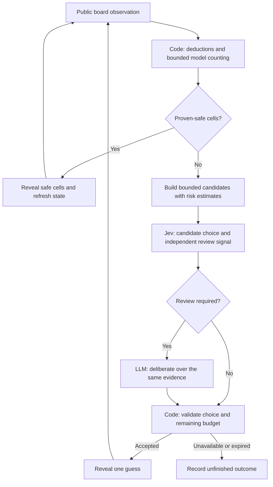

# Testing System One + System Two in Minesweeper

Published research preview, September 22, 2026, in
[Minesweeper Thinking Lab](https://github.com/imom39a/minesweeper-thinking-lab).
The repository includes three runnable experiment variants and the recorded
results. The proposed Solver Lab UI remains future work.

Could a fast decision model handle routine choices while a slower language
model tackles the difficult ones? We tested that idea in our Minesweeper
experiments, using TypeSafe Jev as System One and an OpenRouter LLM as System
Two.

The clearest improvement came from better constraint solving. On 100 held-out
expert boards, our stronger deterministic solver completed **52 boards**,
compared with **32** for the existing heuristic. A small live Jev → LLM pilot
did not demonstrate a further reliability improvement.

That distinction shapes both the architecture and what we test next.

## Three experiments, one research question

The repository preserves the progression: first an LLM-versus-Jev browser
comparison using a shared game policy; then a Jev-only browser that keeps model
input compact on large boards; finally a CLI benchmark with stronger inference
and code, proof-only, Jev, LLM, and hybrid arms. “Jev-only” refers to the model: code
still owns game rules, deductions, and execution.

The first two browsers retain their original policy. The stronger solver and
cascade described below are available in the CLI; they have not yet been wired
into a third browser experience. [Run all three variants](../../README.md)

## What System One and System Two mean here

[TypeSafe describes Jev](https://docs.typesafe.ai/concepts/system-one.md) as a
model for focused, typed judgments over supplied state. It can select from
defined options and return probabilities. An LLM can perform slower,
open-ended deliberation. Recent [LangChain](https://www.langchain.com/blog/building-a-harness-with-jev)
and [Browserbase](https://www.browserbase.com/blog/what-is-jev) experiments
provide examples of combining these roles.

Our application keeps a third responsibility explicit: ordinary code owns the
game rules, observations, budgets and execution. Models make recommendations
within that controller. In Minesweeper, exact search is also essential; much
of the task is mathematical inference rather than interpretation of language.

This diagram describes the experimental cascade. The planned product update
will also skip model calls whenever the risk policy leaves only one allowed
guess; a model cannot change that decision under the present rules.

## The most useful improvement was a stronger baseline

Our original solver combined simple logical deductions with averaged local
mine fractions. Those fractions were useful heuristics, not exact mine
probabilities. Candidate generation could also exclude unconstrained cells
even when they offered a better guess.

The new solver partitions the frontier into components, enumerates bounded
sets of consistent mine assignments, and weights them using the total mine
count and the unconstrained part of the board. Completed calculations can
produce exact probabilities under the board prior. Incomplete calculations
remain explicitly heuristic. Code reveals proven-safe cells automatically.

On expert boards of 30×16 cells with 99 mines, seeds 100–199 were held out
while we selected a component-size cap of 48. The old heuristic won 32/100
and the stronger solver won 52/100. It also reduced guesses from 444 to 266
across those runs. These are improvements from deterministic inference; they
are not evidence of a Jev or LLM advantage.
[Configuration and individual outcomes](../results/expert-heldout.json)

Large boards remain difficult. With the same component cap, the stronger
solver won 7/20 games on 50×50 boards with 500 mines. Its average safe-cell
coverage exceeded 98%, yet most games still ended in a loss. Complete-board
wins matter more than visually impressive progress.
[Large-board records](../results/large-search-48.json)

## What the live hybrid experiment showed

We compared code, Jev, an LLM and the cascade on four identical uncertain
expert observations. The models were `jev-1.13.0` and `openai/gpt-oss-20b`.
Every recommendation passed the same minimum-computed-risk check.

| Policy | Safe next choices | Mine next choices | Failed to return a decision |
| --- | ---: | ---: | ---: |
| Code | 3 | 1 | 0 |
| Jev | 3 | 1 | 0 |
| LLM | 2 | 1 | 1 |
| Jev → LLM | 2 | 1 | 1 |

These are next-action outcomes, not full games. The cascade escalated all
four observations, so its review gate saved no LLM calls in this sample.
Median cumulative provider time was about 0.42 seconds for Jev and 20.70
seconds for the cascade. Two observations had only one admissible minimum-risk
choice, which limited what the models could change. The two remaining
observations had three and two admissible choices.
[Frozen observations and live traces](../results/expert-live-replay-v2.json)

This is a small pilot using one LLM, one prompt policy and bounded response
time. It cannot establish that hybrid architectures never help. It does show
why stronger baselines, failed attempts and the number of genuinely different
available actions belong in the evaluation.

## Confidence is not the chance of avoiding a mine

Jev's Choice confidence describes how concentrated its preference is across
the offered alternatives. It does not mean that the selected cell is safe.
Several equally good guesses can produce a diffuse preference, while a strong
preference can still point to a risky cell. We retain model confidence and
solver mine probability as separate quantities.
[TypeSafe confidence documentation](https://docs.typesafe.ai/confidence.md)

Neither extra confidence nor extra reasoning can resolve two hidden layouts
that produce identical visible evidence. Avoiding unnecessary guesses helps;
some uncertainty remains until another observation is available.

## What comes next

The proposed next web update would make the stronger solver the default and
add a Solver Lab for comparing code, Jev, LLM and hybrid strategies. It will
show which decisions were proven, which were guesses, why a review occurred,
and how much time and how many requests it used. The cascade should remain
experimental while we improve its routing and evaluate it on new cases.

Next we will test deterministic lookahead among equal-risk candidates and
measure whether LLM review can improve decisions beyond that baseline. For
drone work, the transferable ideas are bounded proposals, fresh observations,
independent execution checks and explicit failure handling. Flight needs a
separate evaluation of perception, dynamics and physical consequences.

The [full research report](system-one-system-two-research.md) includes primary
sources, limitations and the recorded experiments. The
[architecture guide](../../docs/architecture.md) maps all three variants to
the code. The [implementation plan](v0.2-release-plan.md) describes the path
from this CLI experiment to a future web release, and the [run guide](../README.md)
contains reproduction commands. The recorded JSON files preserve both the
successful runs and the failed attempts.
