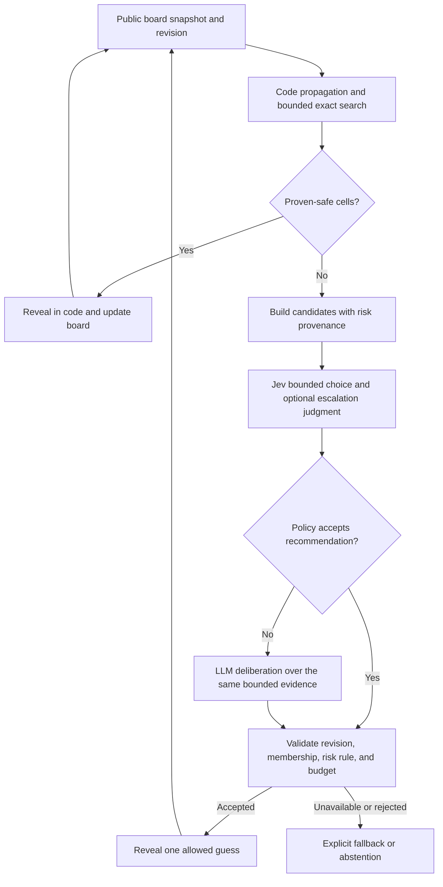

# System One + System Two for reliable Minesweeper

Research date: **2026-09-22**. Published with the standalone
[Minesweeper Thinking Lab](https://github.com/imom39a/minesweeper-thinking-lab)
research preview. [Article](system-one-system-two-article.md) ·
[Architecture](../../docs/architecture.md) · [Run guide](../README.md).

Scope: the current Minesweeper project first; transferable design principles for a later drone experiment. Evidence below distinguishes documented behavior, authors' experimental claims, repository observations, and proposals. No drone changes are part of this research. Design/protocol sections below preserve
the hypotheses that motivated the study; the [measured results](#local-experiment-results)
report what was actually run. The stronger solver and cascade are implemented
in the CLI, while the two browser variants retain their earlier policy.

The useful hypothesis is that **Jev can make bounded, inexpensive judgments while an LLM handles selected harder planning decisions, with ordinary code enforcing the rules**. For Minesweeper, however, constraint solving is a particularly strong baseline. We should demonstrate a benefit over that baseline before crediting either model with better reliability.

## What the recent discussion actually supports

Public searches found the launch-week X discussion, including Sydney Runkle's **“Building a Harness with Jev”** article. Its original [X post](https://x.com/sydneyrunkle/status/2100754364545761643) returned HTTP 403 in this session. The readable [LangChain article by Sydney Runkle and Hunter Lovell](https://www.langchain.com/blog/building-a-harness-with-jev), dated **September 17**, is the primary author/company version: use an LLM for open-ended generation and reasoning, and put Jev into classification, routing, and action-checking steps. It is an integration pattern, not a Minesweeper result.

X access and recency limits matter here: direct reads of the [founder's launch post](https://x.com/CompleteSkeptic/status/2099925682726002904) and [recent company post](https://x.com/typesafeai/status/2102178536970985861) also returned 403. Search indexes and mirrors helped locate original links, but were not used as technical authority. This is a dated survey of discoverable public discussion, **not a verified complete feed of the newest X threads**. No X login, private timeline, or replies were inspected.

The most useful recent primary sources are:

| Date | Source | Evidence and its limit |
| --- | --- | --- |
| September 15 | [TypeSafe launch, Diogo Almeida](https://typesafe.ai/blog/introducing-system-one-models-and-jev) | Introduces Jev, typed decisions, parallel outputs, and RLCD. Large speed/cost multiples are TypeSafe's workload-specific results. The post acknowledges favorable demo inputs and evaluation bias. Schema guarantees do not establish correct gameplay. |
| September 17 | [LangChain harness article](https://www.langchain.com/blog/building-a-harness-with-jev) | Concrete Jev + LLM composition and middleware examples. It supports testing a hybrid architecture, not assuming the hybrid always wins. |
| September 20 | [LangChain judge experiment](https://www.langchain.com/blog/jev-agent-evals-langsmith) | Jev matched the reviewer on 500 repeated binary judgments, but these were **five frozen weather-agent cases**, each repeated 100 times. Repetition tests consistency; five cases are not broad domain coverage. |
| September 21 | [Browserbase, Kyle Jeong](https://www.browserbase.com/blog/what-is-jev) | Their Stagehand experiment classifies actions, constructs candidates, uses Jev choice/presence checks, then executes in code or falls back to an LLM. Early median latency fell from 1.97 s to 0.46 s, about 4.3×. This is the author's browser experiment, not our measured speedup. |
| September 21 | [Diogo Almeida interview, Latent Space](https://www.latent.space/p/jev) | At approximately 1:19–1:23, the creator describes the System One/Two boundary as empirical and discusses difficulty with multi-hop tasks. At 0:58 onward the discussion emphasizes structured state and small decisions. |

LangChain published [its experiment repository](https://github.com/danielgshea/jev-as-a-judge), including frozen cases and labels. It identifies one human reviewer, provider-default LLM settings, and no exposed Jev service version in experiment metadata. These are reasons to preserve our exact model version and independent board count, and to distinguish repeatability from correctness.

## Turn the metaphor into explicit responsibilities

TypeSafe's [System One documentation](https://docs.typesafe.ai/concepts/system-one.md) describes focused judgments over supplied state: Choice selects an option, Score rates a described dimension, and Noul returns a yes/no probability. Jev does not generate prose reasoning or code. Its probabilities are trained for calibration across groups; an individual answer is not guaranteed correct. The cognitive terminology is inspiration, not a verified claim that these models implement human cognition.

In this project, “System Two” should mean the role of slower, deliberate analysis. An LLM may fill that role, but exact CSP/SAT search and model counting are also deliberate computation. Calling every LLM response “reasoning” would hide whether we actually gave it tools, time, and enough evidence. **Jev + an unchanged minimum-risk LLM prompt would mainly test two implementations of the same ranking instruction.** This follows from the current [provider prompts](../agents.py), both of which ask for a proven-safe cell or the lowest supplied risk.

The division of responsibilities tested in the CLI is:

| Layer | Owns | Must not be confused with |
| --- | --- | --- |
| Game and deterministic controller | Observations, legal actions, constraint deductions, budgets, execution, terminal outcomes | A learned model's opinion |
| System One / Jev | A bounded choice among allowed candidates; optional independently evaluated escalation signal | Proof that the chosen cell has no mine |
| System Two / reasoning LLM | Analyze a bounded uncertain component, compare plans, propose a candidate or abstain | Access to hidden mines or permission to override known constraints |
| Exact search | Find forced cells and, when computation completes, compute probabilities under an explicit board prior | A heuristic probability produced after search was cut short |

This separation matches the [TypeSafe building guide](https://docs.typesafe.ai/concepts/how-to-build-with-system-one.md): the application retains calculations, control flow, state, and side effects. Its [Jev 1.13 limitations](https://docs.typesafe.ai/model-jaggedness/jev-1.13.md), reviewed September 17, explicitly call out numerical precision, counting, indirection, and irrelevant large contexts. Those limitations are directly relevant to raw-board Minesweeper prompts.

The closest official cascade example is [structured-data extraction](https://docs.typesafe.ai/cookbooks/sde_cascade.md): a cheap extractor produces a record, batched Jev checks identify suspect fields, and a reasoning model is used when flags fire. The cookbook's 0.7 threshold and internal 100-prompt results illustrate a method. They do not calibrate a Minesweeper decision threshold.

## What the existing Minesweeper code already does

These observations describe the original browser application read for this research. The separate experimental CLI adds stronger logic; the browsers still use this original policy.

| Existing behavior | Implication |
| --- | --- |
| [Game](../game.py) uses a common seeded center opening; mine placement excludes its neighborhood when density permits, and otherwise excludes just the opening cell. | Compare policies on identical seed, dimensions, density, and opening. An opening guarantee is not a no-guess-board guarantee. |
| `deduce()` applies single-clue and subset deductions to a fixed point. | There is already an exact logical core. Preserve and test it before attributing wins to models. |
| `risk_score()` averages local remaining-mine fractions. | This is a heuristic. Overlapping constraints correlate variables, so the average is not an exact posterior probability. |
| `offered_candidates()` normally restricts guesses to the frontier and caps candidates at 24. | The globally safest cell might never reach either model. A hybrid cannot recover omitted actions. |
| Boards above 4,096 cells omit the full grid from model state. Candidate constraint strings contain clue labels/counts, not a complete variable-to-clue graph. | Useful token bounds exist, but a reasoning model needs explicit component variables and equations to reconstruct dependencies reliably. |
| [Server](../server.py) asks a provider even when the offered choices are all proven safe. | An automatic code path can remove many network calls without weakening safety. Measure this benefit separately from hybrid reasoning. |
| `deduce()` scans board coordinates and compares constraint pairs; some density calculations scan all hidden cells. | Bounded model input does not imply constant local computation time on 500×500 boards. Profile game work as well as inference. |

The existing [README](../README.md) correctly describes a shared policy comparison. It does not claim an optimal solver or prove Jev's calibration on mine locations.

## Reliability on large boards

### Use exact constraints before learned guesses

Represent each unknown cell by a Boolean mine variable. Every visible clue gives an equation: the sum of adjacent unknown variables equals the clue minus proven adjacent mines. Treat user flags as hypotheses unless they have been validated. If the total mine count is known, retain the global sum constraint too. This is the modeling approach visible in [Johnny Deuss's solver](https://github.com/JohnnyDeuss/minesweeper-solver) and its source.

That solver first performs cheap propagation, partitions the remaining boundary into disconnected components, groups equivalent cells, enumerates valid models, and combines weighted model counts. It also explicitly distinguishes minimizing the next click's risk from maximizing the eventual chance of winning. Those are separate optimization targets. [Primary implementation and explanation](https://github.com/JohnnyDeuss/minesweeper-solver).

For our experiment, the following are proposed correctness rules, derived from that constraint model:

1. Reveal all currently proven-safe cells in code, then update the observations and repeat propagation.
2. Enumerate small connected components with explicit node/time limits. A cell is forced only if **all** valid assignments from a **completed** search agree.
3. Never promote an incomplete enumeration's observed frequency of zero to a safety proof. Record `incomplete`, `contradiction`, and `exact` separately.
4. Keep assignment counts grouped by component mine count. Combine components with the remaining global mine budget before claiming full-board probabilities.
5. Include unconstrained cells in candidate construction. Do not assume every useful click touches an existing clue.
6. If computation is incomplete, either abstain or explicitly enter a heuristic-guess mode. Report the mode in results.

Why weighting matters can be derived directly. If a frontier assignment uses `k` mines and leaves `U` unconstrained cells with `R-k` mines, that assignment has `C(U, R-k)` full-board completions. For multiple components, sum over compatible component mine counts and multiply their model counts. Equal weighting of frontier assignments generally discards this factor. “Exact local enumeration” and “exact posterior given the complete board evidence” therefore require different labels.

Worst-case optimization remains difficult: de Bondt's [Minesweeper complexity paper](https://arxiv.org/abs/1204.4659) proves hardness for maximum-success play in general constructions. This is not evidence that ordinary boards are all intractable; it is a reason to bound expensive search and measure the component sizes our generator actually creates.

### Ambiguity and compounding risk remain even with perfect inference

Consider two hidden cells with exactly one mine, with all available clues treating them symmetrically. There are two equally possible layouts. Either first click has a 50% failure risk under that prior. Extra reasoning cannot identify the actual layout without new evidence. This is a simple indistinguishability argument, not a claim about the frequency of such positions in our generator.

Long games also amplify small risks. By the probability chain rule, the chance of surviving a fixed sequence of decisions equals the product of each decision's survival probability **conditional on having reached it**. Independence is not required for that identity. As an illustration, if every one of 100 required guesses is conditionally 99% safe, survival is `0.99^100 ≈ 36.6%`; for 1,000 such guesses it is approximately `0.0043%`. These are mathematical examples, not measured board win rates. Variable stopping times and branching policies require averaging over trajectories.

Accordingly, measure **complete-board wins**, losses, abstentions, timeouts, and safe-cell coverage separately. A policy that never guesses can avoid explosions while leaving every difficult board unfinished. It has not solved those boards. Report “missed available deduction” separately from “no safe action found within the search budget”; the latter does not prove that guessing was unavoidable.

## A bounded hybrid worth testing



This diagram captures the target controller design, including revision validation for future web integration. The synchronous CLI implements the core cascade with deadline checks. Its strict experimental policy is: code does all proven-safe work; model recommendations may only choose among candidates tied at the smallest computed risk, using unrounded values for comparisons. That makes model error less able to override supplied evidence and isolates the value of choosing among alternatives. If those risks are approximate, the guarantee is only compliance with the estimate, not minimum true risk. A later preregistered experiment can allow a risk/information tradeoff.

On an uncertain state, ask one Choice for the preferred allowed candidate. Ask the escalation judgment independently in the same request: whether visible structural differences merit slower comparison. Explicitly exclude symmetric guesses that more thinking cannot resolve. The second question cannot inspect the first answer. Code combines both afterward. This batching follows [TypeSafe's fan-out pattern](https://docs.typesafe.ai/patterns/fan-out.md); dependent questions need another call or a code step.

Keep question definitions, threshold, risk tolerance, candidate count, LLM-call cap, and timeout in one reviewable policy configuration. Treat any initial confidence cutoff as a **pilot parameter**, not an established safety threshold. Tune it only on development seeds and freeze it before held-out evaluation.

[Choice confidence](https://docs.typesafe.ai/confidence.md) describes concentration across options. If ten candidates are equally safe, a flat Choice distribution can be appropriate; low confidence does not mean high mine risk. Conversely, strong preference for the “best” candidate does not mean it is safe. Log three distinct quantities: solver risk and its provenance, Jev distribution/confidence, and any LLM self-reported confidence. Never convert one into another without measured calibration for that event.

For LLM escalation, supply named variables, clue equations, component membership, remaining mine count, search completion status, and the same candidate features available to Jev. Ask it to select an allowed candidate or abstain. Free-text explanations are diagnostic; they do not establish proofs. If later allowing newly proposed deductions, require a machine-checkable certificate or re-run the exact checker before executing them.

The current [API contract](https://docs.typesafe.ai/api.md) is `POST /v1/systemone` with `state`, `model`, and typed `questions`. Choice supports at most 255 options; our smaller bound is a harness choice. The [model page](https://docs.typesafe.ai/models.md), read September 22, lists `jev-1.13.0` and says `jev-latest` currently points there. Pin the version for comparisons and record the version returned. Request limits and prices may change; store measured usage and latency with the run instead of assuming launch figures.

## Experiment protocol and falsifiable outcomes

Proposed paired arms, using the same board seeds, opening, budgets, and public evidence:

| Arm | Purpose |
| --- | --- |
| Current heuristic policy, executed in code | Measures the ranking policy without network/model effects. |
| Stronger deterministic solver | Separates improvements from exact inference and automatic safe reveals. |
| Strong solver + Jev guesses | Isolates System One's contribution. |
| Strong solver + LLM guesses | Provides the same harness with System Two only. |
| Strong solver + Jev/LLM cascade | Tests whether routing adds value relative to either model alone. |

The study started with cheap seeded offline runs, then a small explicitly bounded live-provider pilot. Use board size and density as separate axes: low-density boards can clear through flood-fill while denser boards expose guessing behavior. Include ordinary 9×9 and 30×16 games, and scale tests at 50×50, 100×100, and eventually 500×500 only as computation budgets permit. The results below report bounded checks at each size; inclusion of a size does not imply completed boards.

Preserve full per-board records: seed, board size, mine count, opening, code revision, model IDs, policy parameters, win/loss/stall/timeout, coverage, number of guesses, deterministic reveals, completed/aborted exact searches, both providers' calls/errors, escalation rate, fallback count, latency distribution, and usage/cost availability. An unavailable cost is `null`, not zero. Report calls per solved board and total elapsed time, because faster individual guesses may barely affect a solver dominated by local work.

Evaluate win-rate differences on **paired boards**, with uncertainty intervals and the number of independent seeds clearly stated. Repeating a model on one board measures stochasticity, not new board coverage. Also use saved identical uncertain states to measure whether escalation improves decisions: full games diverge after their first different action, so later turns are no longer matched evidence. Keep test seeds out of prompt/threshold tuning.

The hypothesis is weakened if the cascade merely spends more time to reproduce the deterministic choice, if it escalates harmless ties constantly, or if all reliability gains are explained by stronger code. It is supported if held-out runs show a useful cost/latency/win-rate tradeoff versus the **same** deterministic harness and the single-provider arms. A handful of successful games establishes plumbing, not superiority.

## Local experiment results

**Measured conclusion: stronger deterministic inference improved completion; this small live pilot did not demonstrate an additional reliability benefit from Jev → LLM.** The experiment is implemented in [solver.py](../solver.py), [hybrid.py](../hybrid.py), and [benchmark.py](../benchmark.py), independently of the existing web comparison. These are local measurements from September 22, now published as historical records, not claims about other workloads or all reasoning models. Packaging the standalone repository is not a new live evaluation.

### Offline full-board results

Every arm uses the same seeded center opening. The heuristic arm executes the existing ranking in code; it also batches proven-safe reveals, so this does not compare the new solver against avoidable network overhead. The stronger solver does bounded component enumeration plus global weighting. `proof` stops when it has no proven-safe action within its budget; it does not certify that guessing is mathematically unavoidable.

| Boards / seeds | Old heuristic wins | Stronger code wins | Proof-only wins / abstentions | Artifact |
| --- | ---: | ---: | ---: | --- |
| 9×9, 10 mines; 0–29; component cap 22 | 29/30 | 30/30 | 28 / 2 | [Beginner](../results/beginner-offline.json) |
| 30×16, 99 mines; 0–99; cap 22 | 32/100 | 41/100 | 14 / 86 | [Expert development](../results/expert-offline.json) |
| 30×16, 99 mines; 0–99; cap 48 | 32/100, same reference | 46/100 | 16 / 84 | [Larger search](../results/expert-search-48.json) |
| **30×16, 99 mines; held-out seeds 100–199; cap 48** | **32/100** | **52/100** | **15 / 85** | [Held-out comparison](../results/expert-heldout.json) |
| 50×50, 500 mines; 0–19; cap 22 | 3/20 | 6/20 | 2 / 18 | [Large](../results/large-offline.json) |
| 50×50, 500 mines; 0–19; cap 48 | 3/20, same reference | 7/20 | 3 / 17 | [Larger search on large boards](../results/large-search-48.json) |
| 100×100, 2,000 mines; 0–9; cap 22 | Not run | 0/10 | 0 / 10 | [Very large](../results/very-large-offline.json) |
| 500×500, 50,000 mines; seed 0; cap 22 | Not run | 0/1; time limit | 0; time limit | [Maximum-size bounded run](../results/maximum-board-bounded.json) |

The held-out comparison is a **20 percentage-point observed improvement**. There were 23 seeds on which only the stronger solver won and three on which only the heuristic won; 29 were mutual wins and 45 mutual losses. Separate Wilson 95% intervals are 42.3–61.5% for the stronger solver and 23.7–41.7% for the heuristic; these are intervals for the individual rates, not a paired difference interval. The stronger solver made 266 guesses versus 444. Component cap 48 was selected using the earlier seeds and frozen before running seeds 100–199. No learned-model claim follows from this offline result. [Held-out raw records](../results/expert-heldout.json)

At 50×50 with cap 48, mean safe-cell coverage was 98.63%, but **13 of 20 games still lost**. At 100×100 the solver averaged 89.72% coverage while losing every game. The 500×500 experiment reached 7.82% coverage before its approximately ten-second budget; it demonstrated bounded execution, not completion. Coverage would be a misleading primary success metric here. [50×50 records](../results/large-search-48.json), [100×100 records](../results/very-large-offline.json), [500×500 records](../results/maximum-board-bounded.json)

The ordinary runs use a shared 200,000-node enumeration budget per analysis and a separate bounded global-weighting operation budget. Cap 48 is a maximum component size, not a promise of exhaustive search on every component. The episode budget was ten seconds except the 100×100 run's fifteen seconds. Wall-clock checks occur around local work and after reveals; an individual solver computation or flood reveal is not preempted. A completion arriving after the deadline is recorded as timed out in the final harness.

### Live Jev / LLM pilot

The actual models were **`jev-1.13.0`** and **`openai/gpt-oss-20b` through OpenRouter**, with LLM output capped at 2,048 tokens, a twenty-second Jev timeout and thirty-second LLM timeout. This tests one small reasoning model and these prompts/budgets; it does not rule out gains from a different model, tools, or longer-horizon policy. Credentials were loaded through `source scripts/load-jev-env.sh` and are absent from reports.

The final `system-one-two-v2` gate batches a cell Choice and review Noul in one Jev request. It escalates if enumeration is incomplete, the suggested cell violates the candidate/risk policy, or the independent review probability is at least **0.65**. That threshold is **uncalibrated**. Choice confidence is recorded but does not trigger escalation by itself. The earlier v1 pilot used an additional concentration gate; review caught that it could escalate a tie between equally good cells merely because worse options also existed, and v2 removes it.

Four identical frozen expert observations, the first unresolved state from each of seeds 1–4 under cap 48, produced:

| Policy | Safe next reveals | Mine next reveals | No decision | Provider calls | Median cumulative provider time per state |
| --- | ---: | ---: | ---: | --- | ---: |
| Code | 3 | 1 | 0 | 0 | — |
| Jev + guard | 3 | 1 | 0 | 4 Jev | 0.42 s |
| LLM + guard | 2 | 1 | 1 | 4 LLM | 14.57 s |
| Jev → LLM + guard | 2 | 1 | 1 | 4 Jev + 4 LLM | 20.70 s |

These are **one-step counterfactuals, not four full-board wins/losses**. Every hybrid state escalated, so the current review question/threshold provided no call savings on this sample. LLM-only had one timeout; hybrid had one unusable JSON decision. For the three completed hybrid decisions, there were zero rescues and zero harms compared with the **guarded** initial Jev choice. Failures are separate abstentions, not credited as safely avoiding a mine. [Final frozen states, raw decisions and summary](../results/expert-live-replay-v2.json)

Two observations had a unique minimum-risk candidate, so the deterministic guard forced the same action regardless of the models. The other two had three and two admissible candidates respectively. Provider calls on a unique-minimum state measure overhead; a production controller should skip them. The model context includes bounded clue equations and candidate coordinates but not full visible-board geometry, so this is a limited test of tie selection rather than a full expected-information-gain planner. All four cap-48 observations had complete exact probabilities; one still had a mine under the selected minimum-risk cell. More confidence could not turn that guess into proof. [Frozen public states](../results/expert-live-replay-v2.json)

The earlier [six-state v1 exploratory replay](../results/expert-live-replay.json), on cap-22 states from seeds 0–5, also showed no demonstrated hybrid benefit: code/Jev each selected five safe cells and one mine; LLM/hybrid each returned three safe decisions and failed to return three. It used a different gate and different snapshots, so do not pool it with v2 as a controlled gate comparison. The reports retain those unsuccessful attempts.

For an end-to-end live plumbing check, all four arms completed both 9×9 boards at seeds 1–2. Only one guess was required across those two games: code used zero provider calls, Jev one, LLM one, and hybrid one Jev call with no escalation. Two easy games establish functioning integration, not a win-rate advantage. [Full episode records](../results/beginner-live-episodes.json)

Raw per-call usage and reported OpenRouter costs are retained. Costs missing from provider replies, including some failed or malformed responses, remain unknown; the reported sum is not a complete experiment bill. Latencies are local pilot observations with concurrent local activity, not controlled service benchmarks. Later reports record source hashes; early exploratory files predate that instrumentation. Replay summaries were derived from the retained raw records without changing outcomes.

### Reproduce and continue

From the repository root:

```bash
# Reproduce the held-out deterministic comparison.
python3 -m minesweeper.benchmark --max-component-cells 48 \
  --seed-start 100 --seeds 100 --seconds 10 \
  --output /tmp/minesweeper-expert-heldout.json

# In bash: replay the final live comparison (spends provider credits).
source scripts/load-jev-env.sh
python3 -m minesweeper.benchmark --live --modes code,jev,llm,hybrid \
  --jev-model jev-1.13.0 --llm-model openai/gpt-oss-20b \
  --max-component-cells 48 --seeds 10 --replay-states 4 \
  --seconds 50 --max-calls 2 \
  --output /tmp/minesweeper-expert-live-replay-v2.json
```

Each JSON artifact also records its complete command configuration. The commands above write new reports to `/tmp` to preserve the published evidence. Offline deadlines depend on machine speed; live outputs and latencies can vary. The deterministic regression suite has **57 passing tests**, including exhaustive small-board probability comparisons, observation isolation, incomplete/recursive-search fallback, guard behavior, budget exhaustion, expired decisions, and replay truth isolation. `compileall` and the original playground's JavaScript syntax checks also passed at the time of the study. This standalone Python package requires no Node.js tooling.

The most justified next Minesweeper work is to cache/incrementally update frontier constraints, expand bounded exact inference where useful, and add deterministic lookahead among equal-risk candidates. Skip model calls when code already determines the action. Then test Jev's review signal against measured LLM rescues on new held-out **tie states**, including a random-escalation control at the same call rate. Only add the hybrid to the main game flow after it demonstrates a useful win-rate/cost tradeoff against the same solver. None of the current results supports promising reliable completion of arbitrary large random boards.

## What can later transfer to drone flight

The transferable hypotheses are the architecture and measurement discipline: immutable observation snapshots, bounded action proposals, asynchronous slow planning, checked execution, explicit timeouts, and independent fallback behavior. The specific confidence cutoff or win rate cannot transfer from this game to a drone.

[Neural Simplex Architecture](https://arxiv.org/abs/1908.00528) provides a primary research precedent for supervising an advanced controller with a decision module and baseline controller. Its safety claims depend on its modeled conditions; it is not a certification of Jev or our flight project. For a later drone prototype, the ordinary controller would enforce dynamics, limits, and recovery while models propose high-level actions.

For a concrete timing example, [PX4's offboard documentation](https://docs.px4.io/main/en/flight_modes/offboard) requires a continuous proof-of-life stream and a configured response to signal loss. Our inference from that contract is to keep this control obligation independent of remote model requests. Median AI latency alone cannot guarantee deadlines, freshness, or continuity. Jev's current [text-only input](https://docs.typesafe.ai/concepts/system-one.md) also means drone observations need an explicit perception/state layer; the API does not directly consume camera frames.

A later simulation should test delayed/stale responses, dropped requests, contradictory observations, unavailable models, and recovery, with mission completion and constraint violations measured separately. Minesweeper is a useful place to develop that harness because actions and outcomes can be replayed exactly. It is not evidence of physical-flight reliability by itself.
